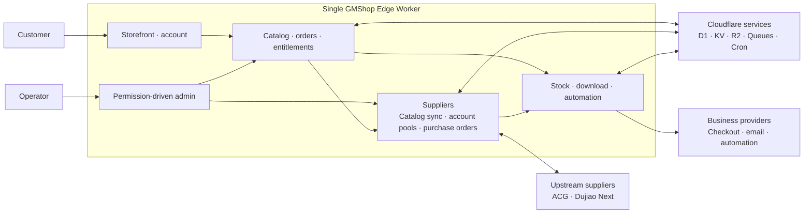

# Architecture

GMShop Edge runs as one Cloudflare Worker that owns the public shop, customer account area, checkout, fulfillment, and administration console.

## Cloudflare bindings

The repository declares these production bindings in `wrangler.jsonc` and `package.json` metadata:

- `DB`: D1 database for authentication, RBAC, catalog, money, orders, inventory, entitlements, suppliers, jobs, replay protection, rate limits, outbox, audit, and system data.
- `FILES`: private R2 bucket for product media, downloads, automation artifacts, and exports.
- `CACHE`: KV namespace for short-lived RBAC and public-configuration caches. Security-critical limits remain D1-authoritative.
- `COMMERCE_QUEUE`: Cloudflare Queue for durable delivery, automation, notification, and refund work.
- `EMAIL`: optional Cloudflare Send Email binding for the credential-free email provider.

The Worker also enables Cron Triggers; the repository currently declares `* * * * *` for periodic commerce work.

## Data ownership

D1 is authoritative for core commerce state. KV is intentionally limited to validated, versioned, bounded upstream catalog snapshots and read caches. R2 stores private objects, but object access is resolved through authorized D1 records; clients do not choose object keys.

## Module boundaries

Routes stay thin. Feature pages, schemas, server functions, and domain behavior live under `src/features`; cross-domain runtime plumbing lives under `src/server`; the clean-install Drizzle baseline is `drizzle/0000_gmshop.sql`.

## Operational model

Queue and Cron move catalog synchronization, supplier purchasing and reconciliation, fulfillment, retries, retention, and key rotation outside synchronous requests. This keeps storefront checkout responsive while preserving retry and audit history for background work.
