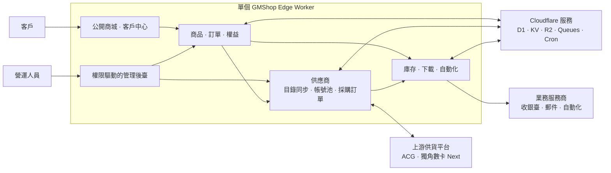

# 架構

GMShop Edge 以單個 Cloudflare Worker 承載公開商城、客戶中心、結帳、交付與管理後臺。

## Cloudflare bindings

倉庫在 `wrangler.jsonc` 與 `package.json` metadata 中宣告這些生產 bindings：

- `DB`：D1 資料庫，保存認證、RBAC、商品、金額、訂單、庫存、權益、供應商、任務、重放保護、限流、outbox、審計與系統資料。
- `FILES`：私有 R2 bucket，保存商品媒體、下載檔案、自動化制品與匯出。
- `CACHE`：KV namespace，保存短生命週期 RBAC 與公開配置快取；安全關鍵限流仍以 D1 為權威來源。
- `COMMERCE_QUEUE`：Cloudflare Queue，用於可靠交付、自動化、通知與退款工作。
- `EMAIL`：可選 Cloudflare Send Email binding，用於免憑證郵件 Provider。

Worker 也啟用 Cron Triggers；目前倉庫宣告 `* * * * *` 週期性執行交易工作。

## 資料權威來源

D1 是核心交易狀態的權威資料源。KV 僅保存經校驗、帶版本且有界的上游目錄快照與讀取快取。R2 保存私有物件，但物件存取必須透過 D1 授權記錄解析；客戶端不能自行選擇 object key。

## 模組邊界

路由保持薄層。功能頁面、schema、Server Function 與領域行為位於 `src/features`；跨領域執行時編排位於 `src/server`；全新安裝的 Drizzle 基線是 `drizzle/0000_gmshop.sql`。

## 運維模型

Queue 與 Cron 將目錄同步、供應商採購與核驗、交付、重試、保留清理與密鑰輪換移出同步請求，讓商城結帳保持響應，同時保留背景工作的重試與審計歷史。
